# Curriculum Builder

The Curriculum Builder is designed for faculty members to create and refine course content, build structured curricula, and continuously improve teaching materials.

This guide walks through the full workflow: **Landing page → Model → Courses → Programme → Download Installation Package**.

## Select Curriculum Builder Persona

1. On the application home page, click **Curriculum Builder Persona**.
2. Click **Get Started**.

    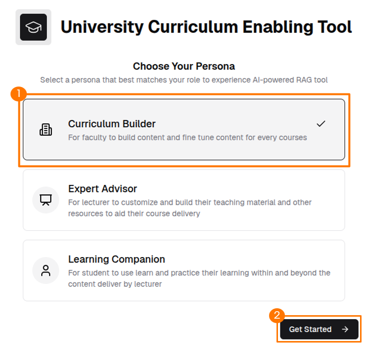

## Landing Page

After selecting the persona, the landing page displays a summary of existing models, courses, and programmes.

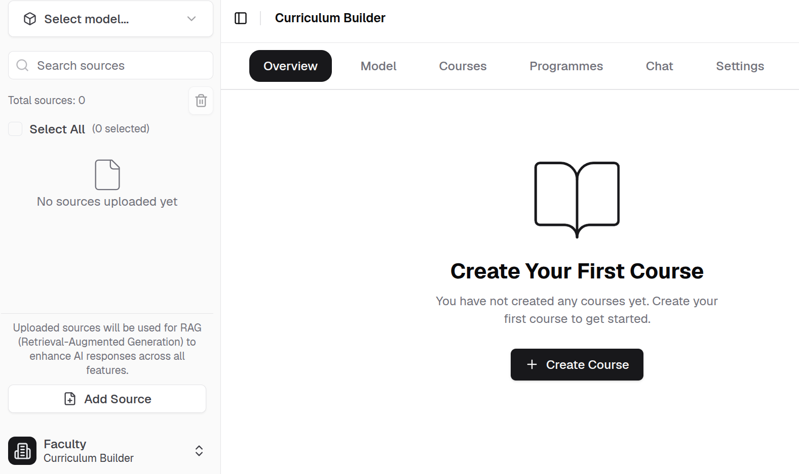

## Model

At least one AI model must be added before creating a course. The model provides the intelligence behind course content generation.

1. Click **Add Model** on the Model page.

    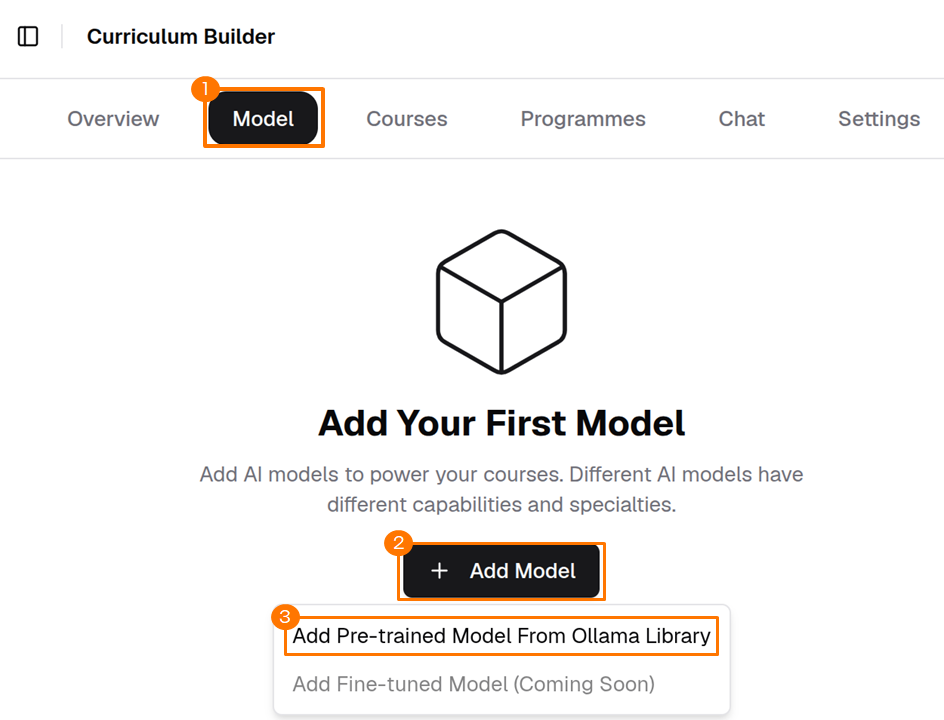

2. Select a model from the **Ollama*** Library and click **Download**.

    !!! info
        The available model sources depend on the AI Model Provider configured during setup.

    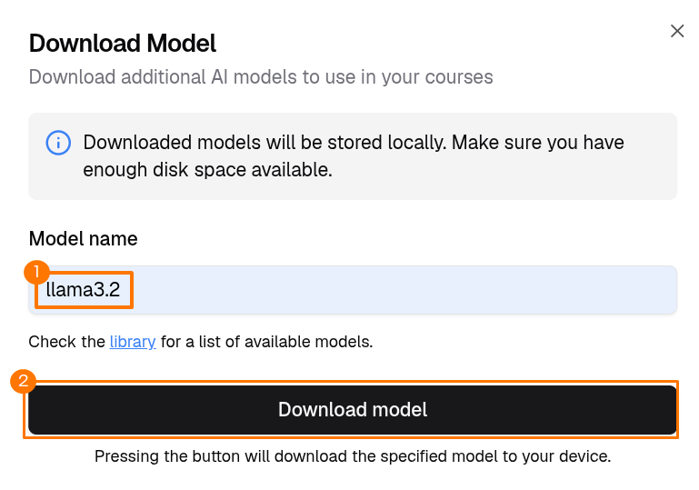

3. Once the download completes, the model appears on the Model page and is ready to use.

    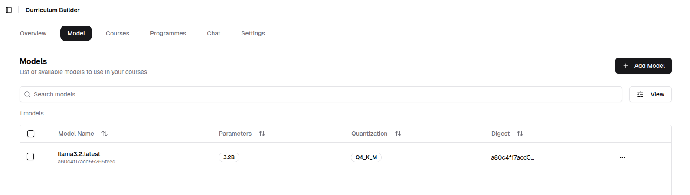

## Courses

A course is the core unit of content in the curriculum. Each course is linked to an AI model that powers its learning experience. Create at least one course before building a programme.

1. Click **Create Course** on the Course page.

    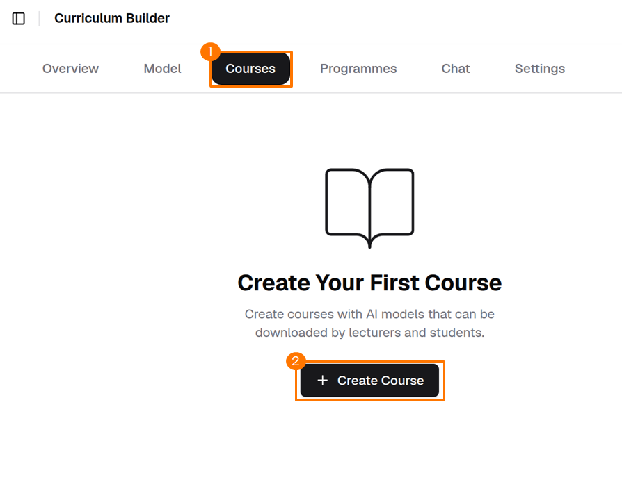

2. Fill in the required course details and click **Next**.

    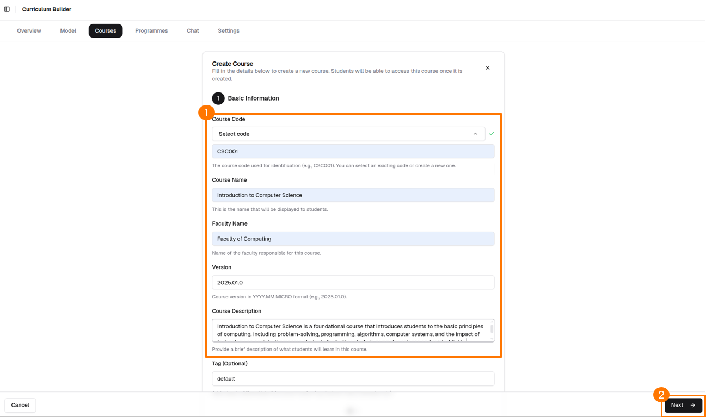

3. Select the downloaded model in the **Model** section, then click **Create Course**.

    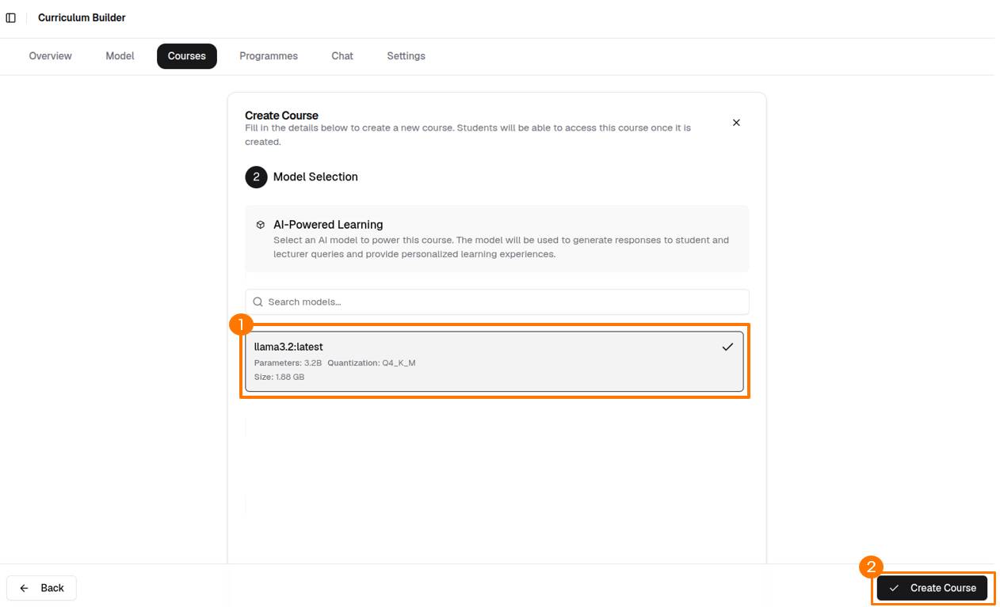

4. The Course page reloads displaying the newly created course.

    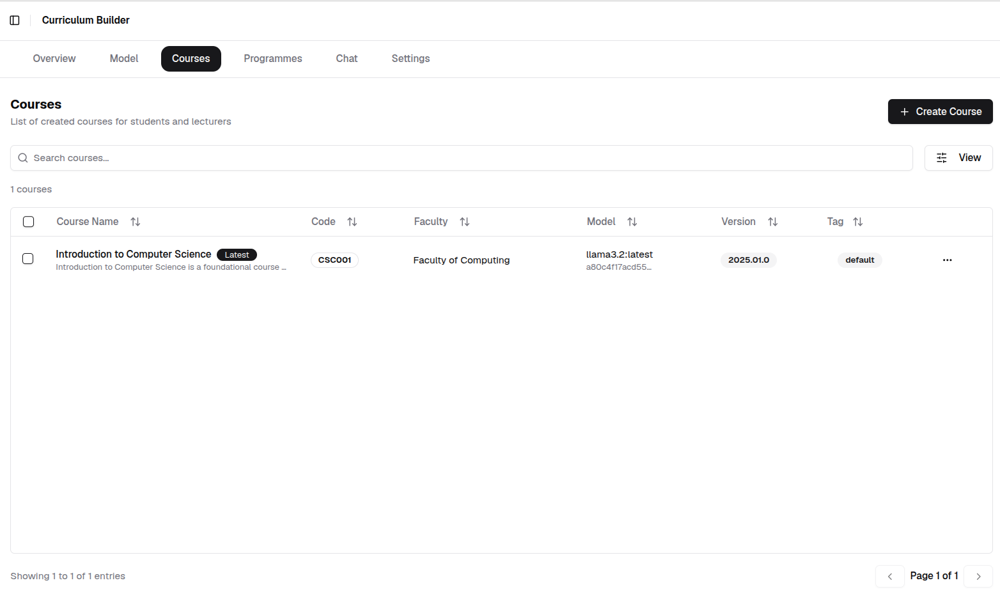

## Programme

A programme groups one or more courses into a structured learning path. Create a programme and assign courses to it before exporting the installation package for the Expert Advisor and Learning Companion.

1. Click **Create Programme** on the Programme page.

    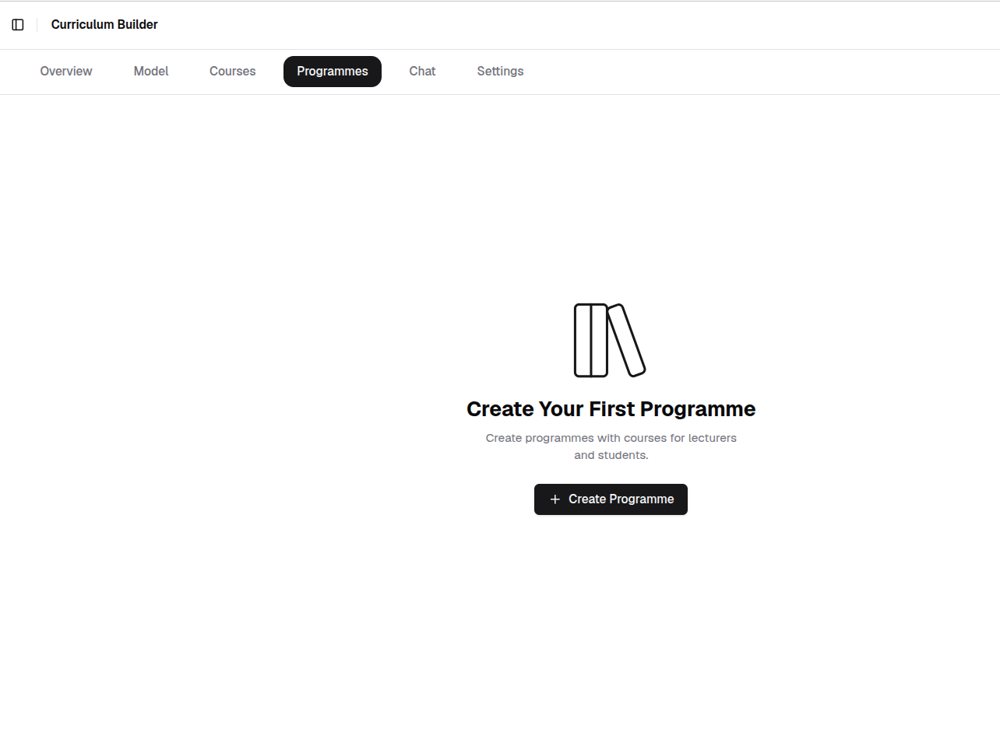

2. Fill in the required programme details and click **Next**.

    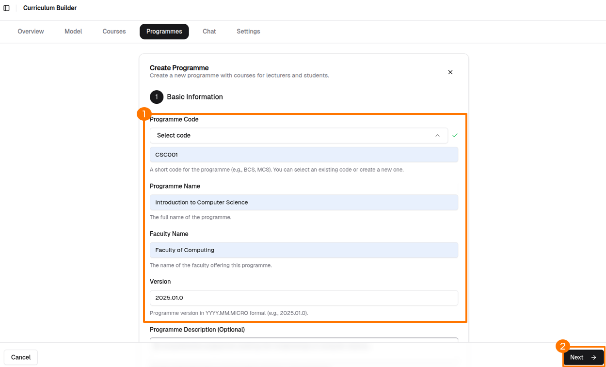

3. Select the course in the **Available Courses** section, then click **Create Programme**.

    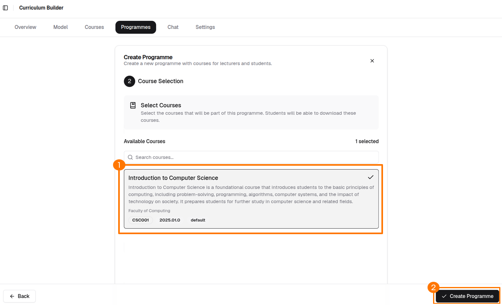

4. The Programme page reloads displaying the newly created programme.

    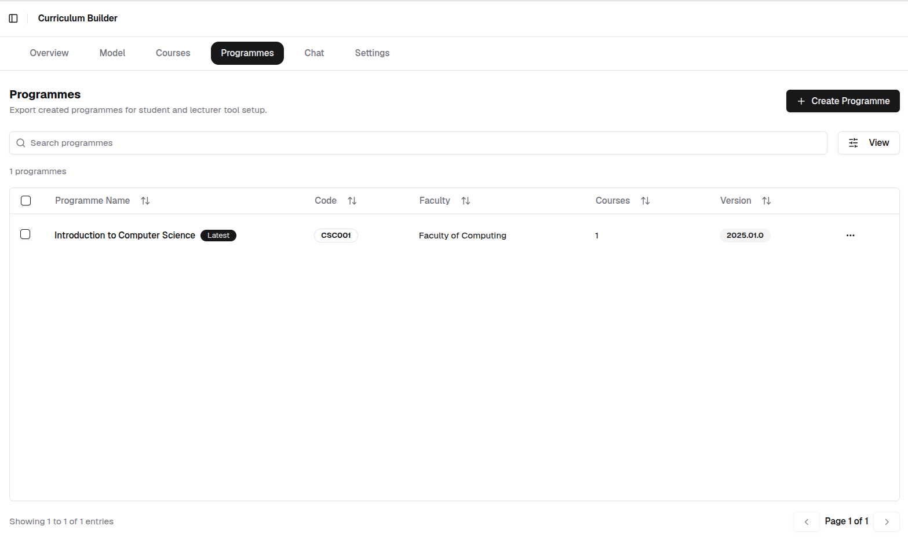

## Download Installation Package

The installation package bundles the programme content for distribution to Expert Advisor and Learning Companion users.

1. On the Programmes dashboard, click **...** beside the target programme and select **Download Installation Package**.

    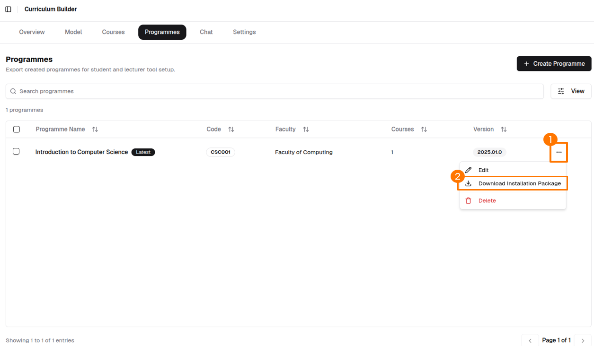

2. Select the target user package and click **Download Package**. The package downloads automatically and is ready to share with the target users.

    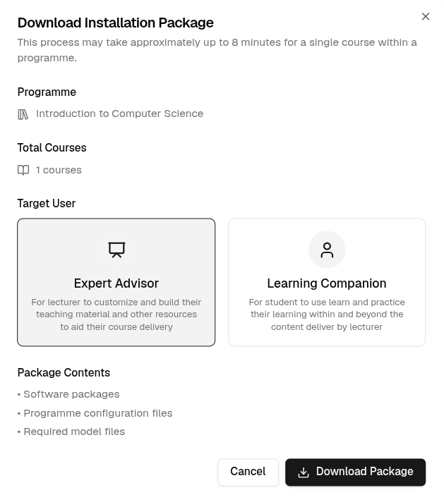

## AI Chat

The Chat page allows you to chat with a downloaded model using Retrieval-Augmented Generation (RAG).

1. Select the model from the top-left corner.

    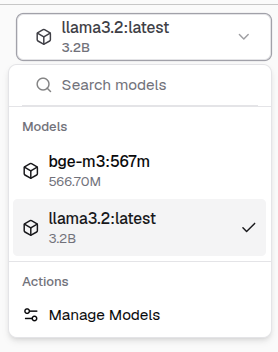

2. Click **Add Source** in the bottom-left corner.

    

3. Upload your document and click **Upload**.

    !!! info
        The currently supported format is PDF only.

    

4. Check the checkbox next to a source in the sources list.

    !!! info
        Selecting a document as a knowledge source is optional.

    

5. Start chatting with the selected AI model.

    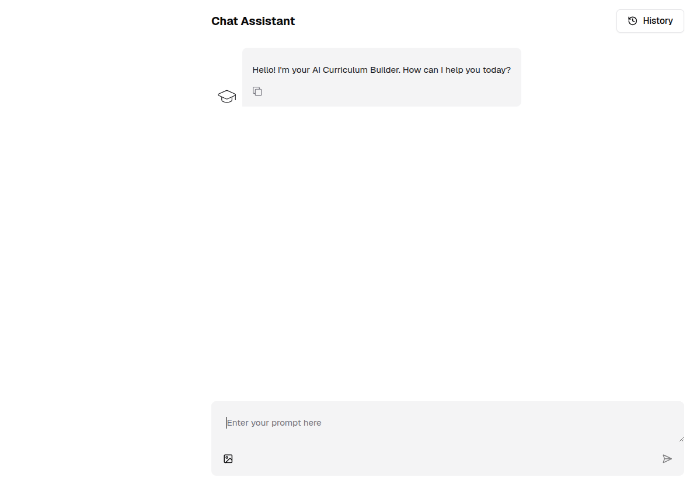

---
