# Expert Advisor

The Expert Advisor is designed for lecturers who deliver courses using a pre-configured installation package provided by a Curriculum Builder.

This guide covers the full workflow: **Landing Page → Add Courses → Add RAG Document Source → Course Content Generator → Summary Generator → Assessment Generator → FAQ Generator → AI Chat**.

## Select Expert Advisor Persona

1. On the application home page, click **Expert Advisor Persona**.
2. Click **Get Started**.

    

## Landing Page

After selecting **Get Started** as Expert Advisor, the landing page is displayed.

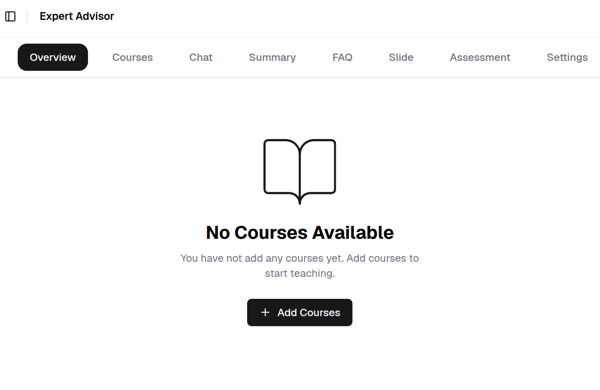

## Add Courses

1. Click **Courses** then click **Add Courses** to upload courses from the installation package.

    

2. Upload the programme configuration file.

    The programme configuration JSON file is included in the extracted installation package.

    !!! info
        Example programme configuration file name format:

        `programme-<programme_code>-<programme_version>-UCET-<application_version>.json`

    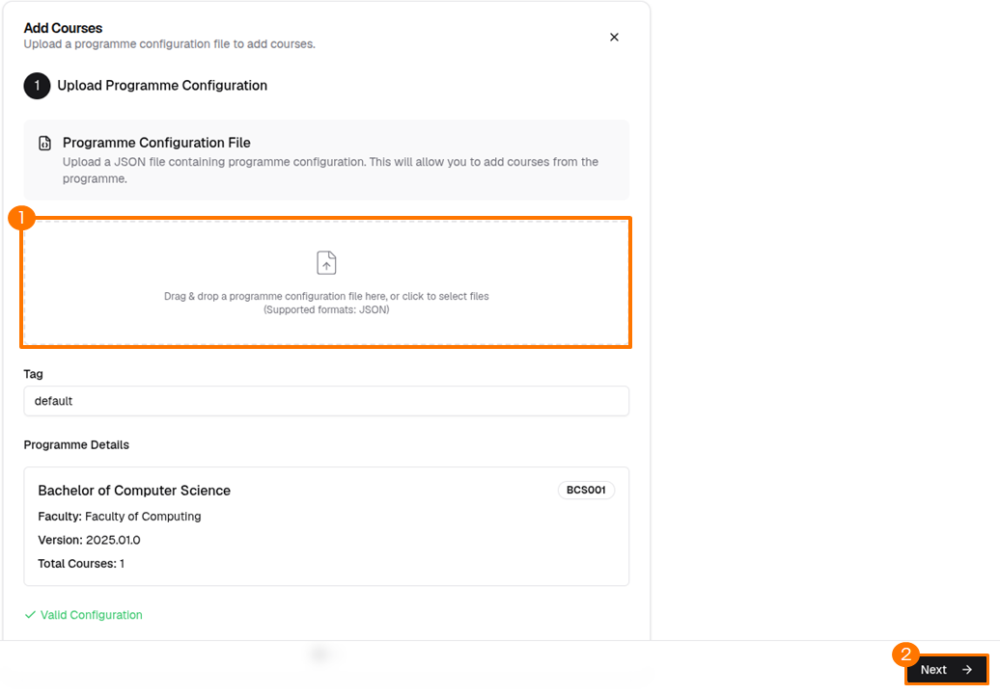

    After uploading the programme configuration file, click **Next**.

2. Select the courses to add.

    Choose the target courses from the available courses list, then click **Add Selected Courses**.

    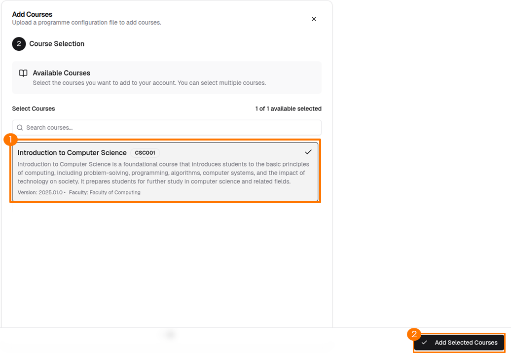

3. Select the active course.

    Select a course from the course selector in the top-left corner.

    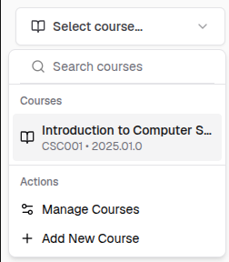

## Add RAG Document Source

Uploaded sources are used for Retrieval-Augmented Generation (RAG) to enhance AI responses across all features.

1. Click **Add Source** in the bottom-left corner.

    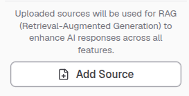

2. Upload your document and click **Upload**.

    !!! info
        The currently supported format is PDF only.

    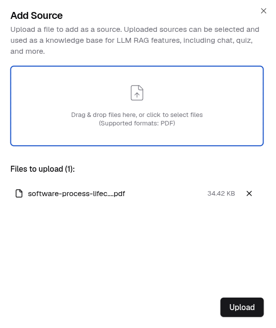

3. Check the checkbox next to a source in the sources list.

    !!! info
        Selecting a document as a knowledge source is optional.

    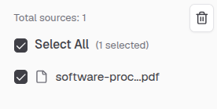

## Course Content Generator

Generate teaching materials with RAG-powered content based on your selected source documents.

!!! info
    The quality of generated content depends on the relevance and quality of your source materials.

1. Click **Slide**, then click **Create Teaching Materials**.

    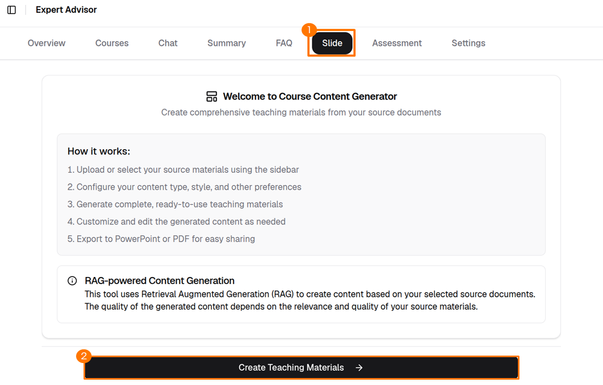

2. Enter the topic name, configure the available options, then click **Generate Teaching Materials**.

    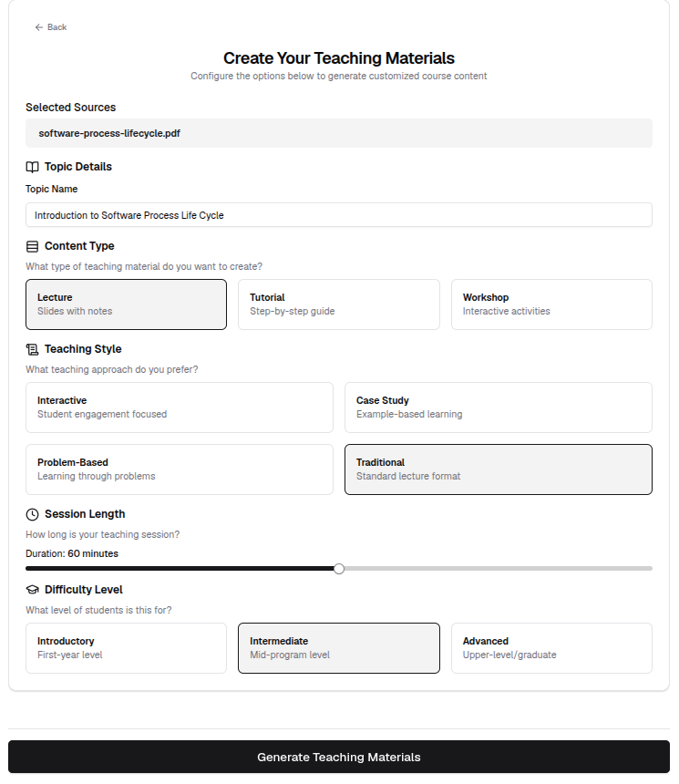

3. Once generated, use the tabs to navigate between sections. To download, click the **PDF** or **PowerPoint*** icon at the bottom of the page.

    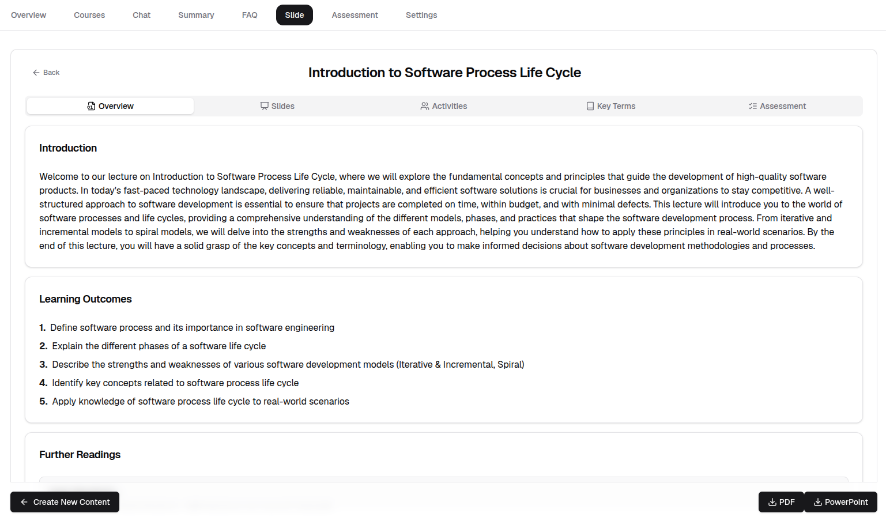

## Summary Generator

Generate a summary from a single uploaded document.

!!! info
    Only one document can be selected at a time for summary generation.

1. Select a document using the file selector in the sidebar.

    

2. Select the active course from the course selector in the top-left corner.

    

3. Click **Generate Summary** at the bottom of the page.

    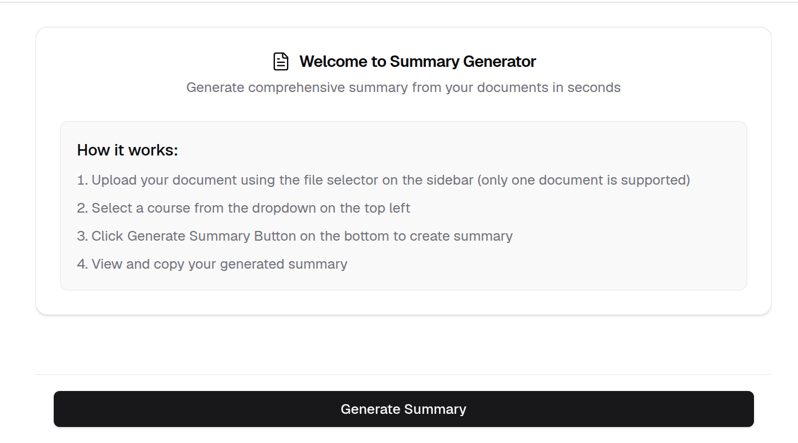

4. Once the summary is generated, scroll to the bottom to find the export options. Select your preferred format to download.

    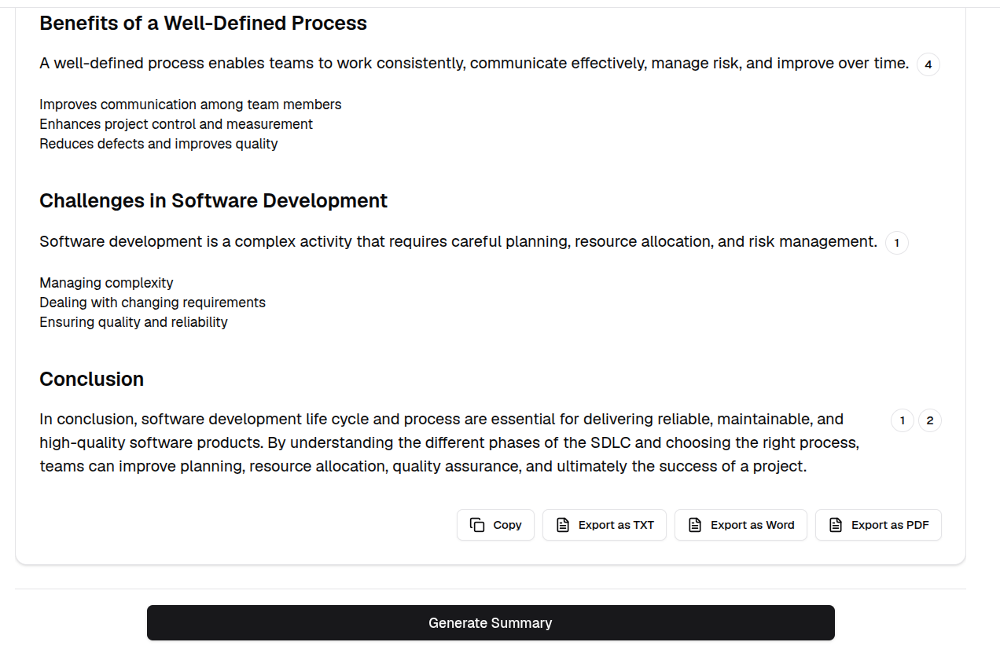

## Assessment Generator

1. Click the **Assessment** tab, then select the assessment type. The steps below use Quiz as an example.

    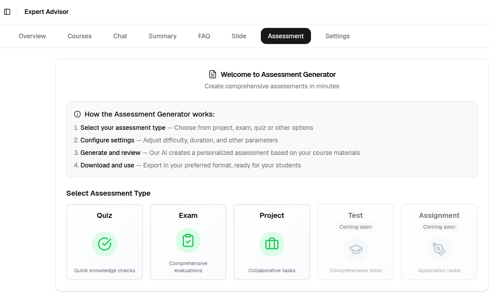

2. Click **Create Quiz**.

    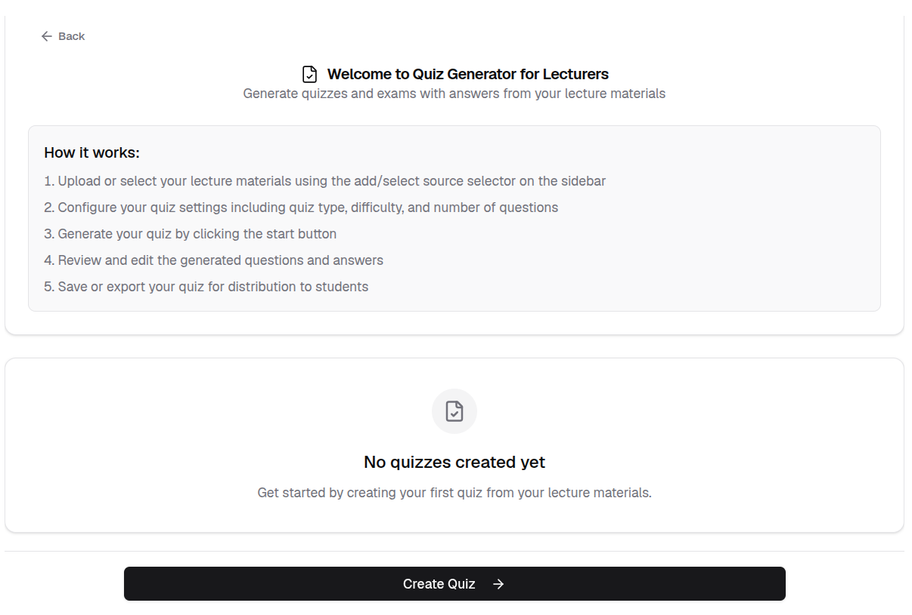

3. Enter the quiz title, configure the quiz type using the available options, then click **Generate Quiz**.

    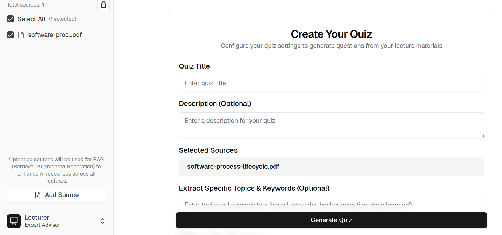

4. Review the generated quiz, then click **Save Draft** or **Publish Quiz**.

    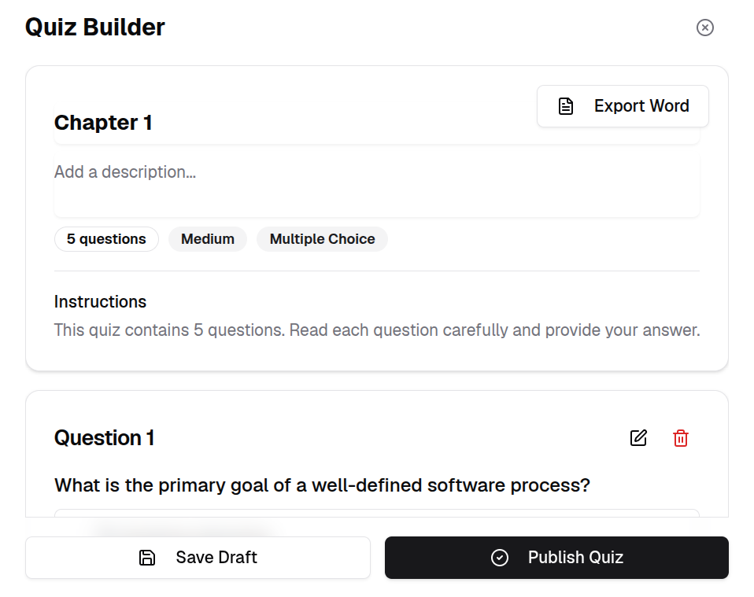

5. The generated quiz appears in **Your Quiz History**.

    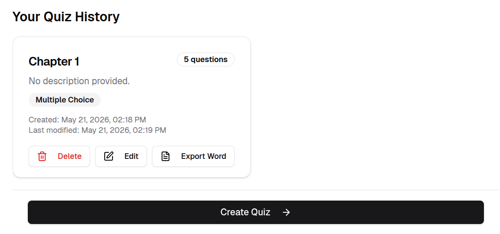

## FAQ Generator

1. Check the checkbox next to a source in the sources list to apply a document source.

    

2. Configure the **FAQ Settings**, then click **Generate FAQs**.

    !!! info
        Optionally enter keywords to focus on specific topics.

    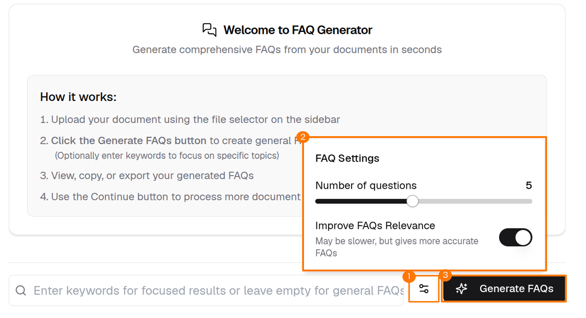

3. Review the generated FAQs. Click **Continue** to generate more FAQs based on the source document.

    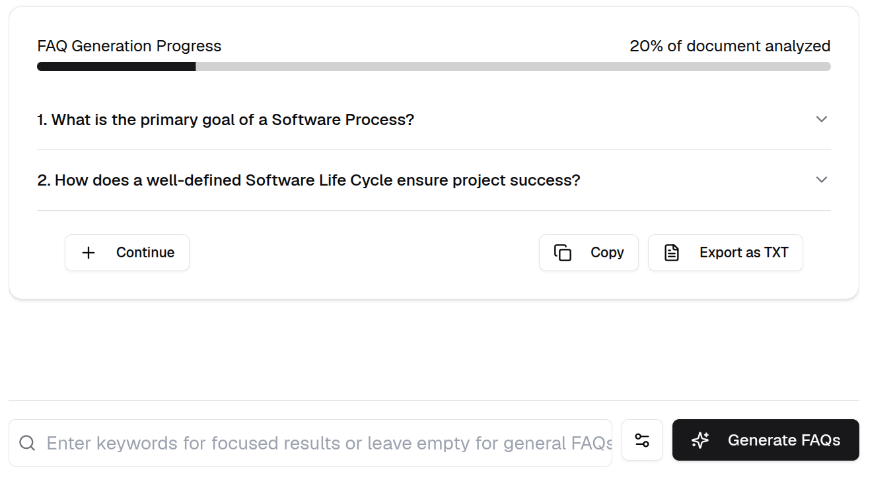

---

