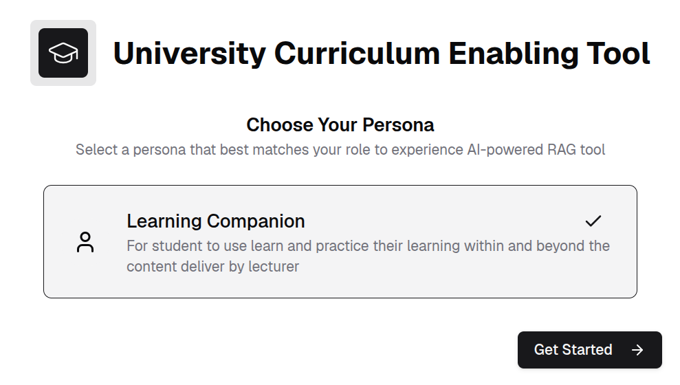
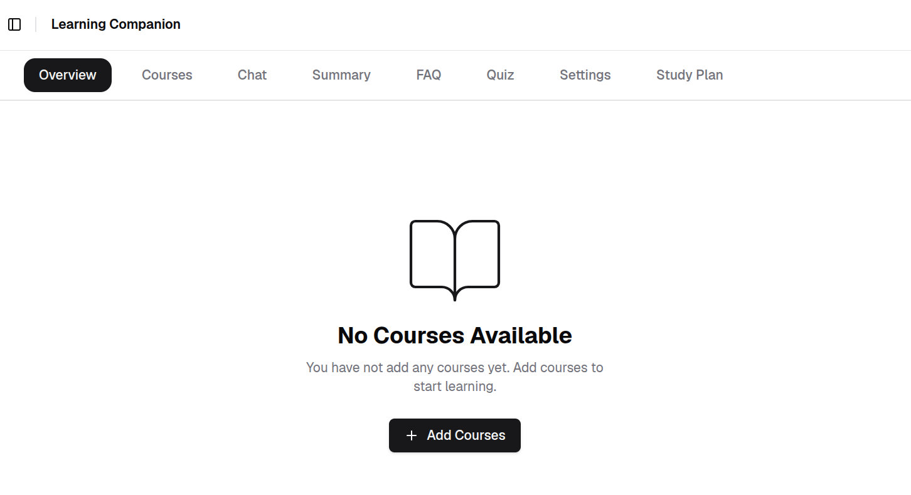
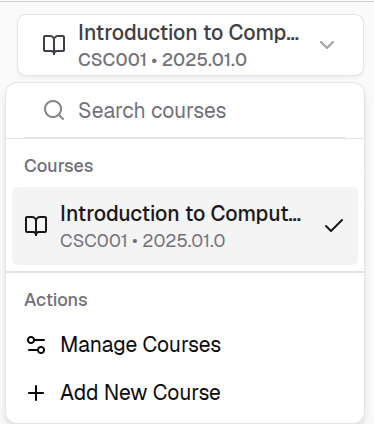
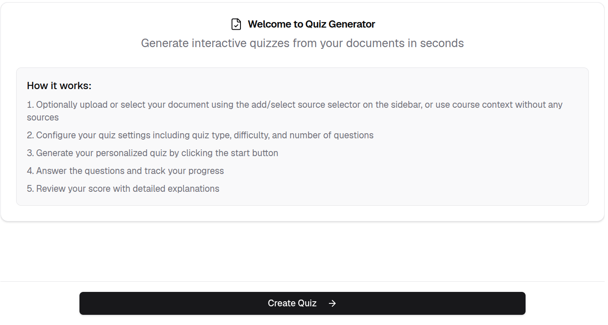
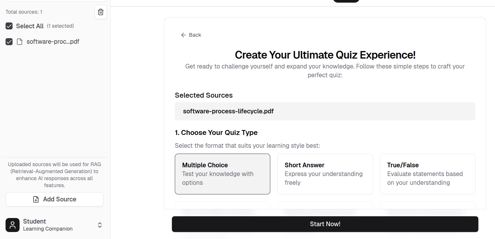
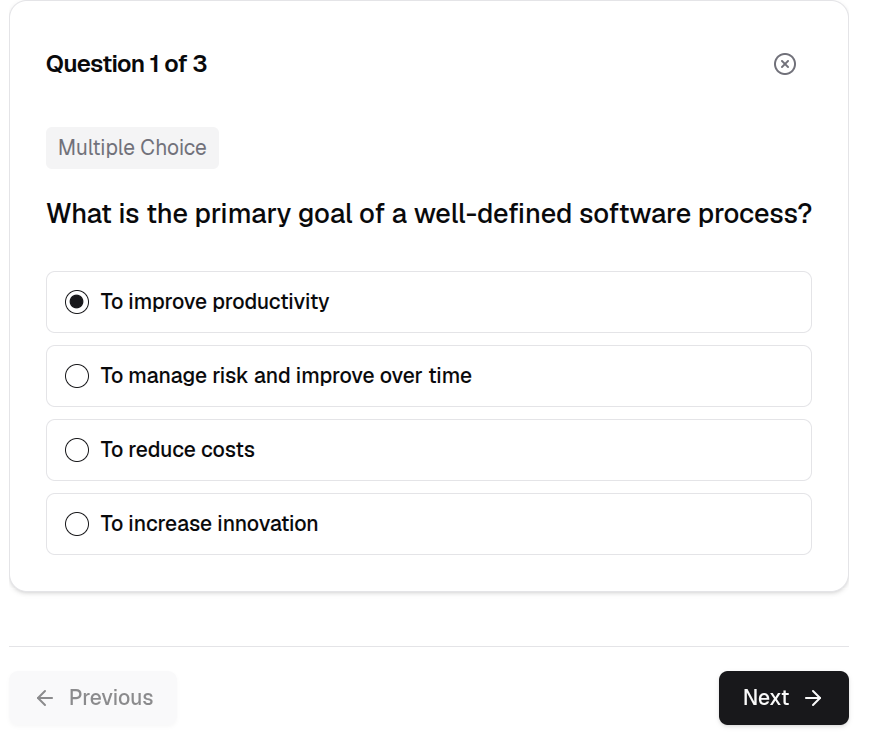
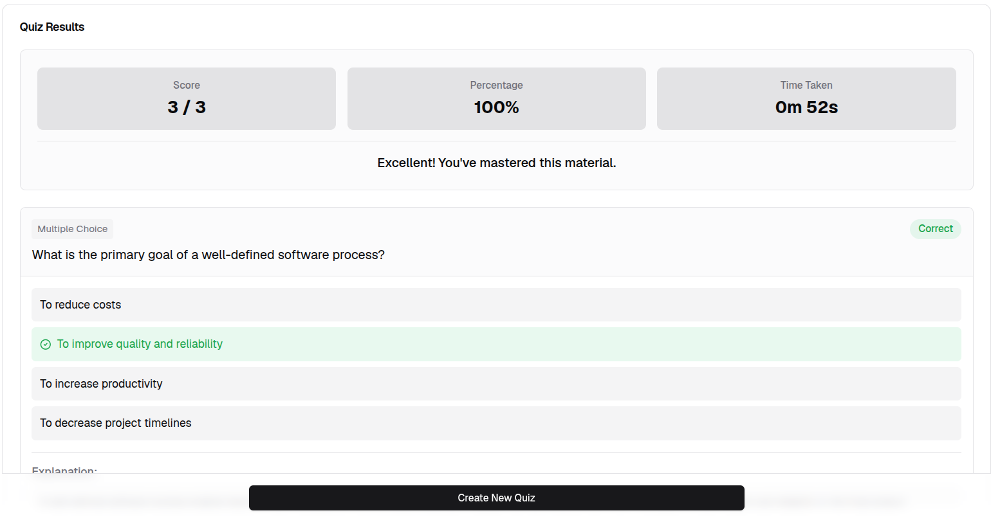
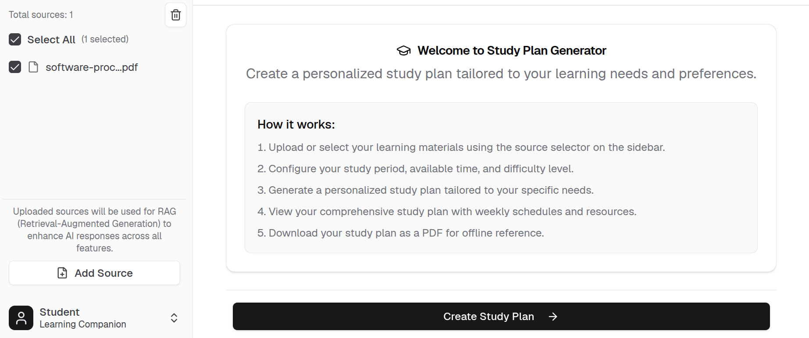
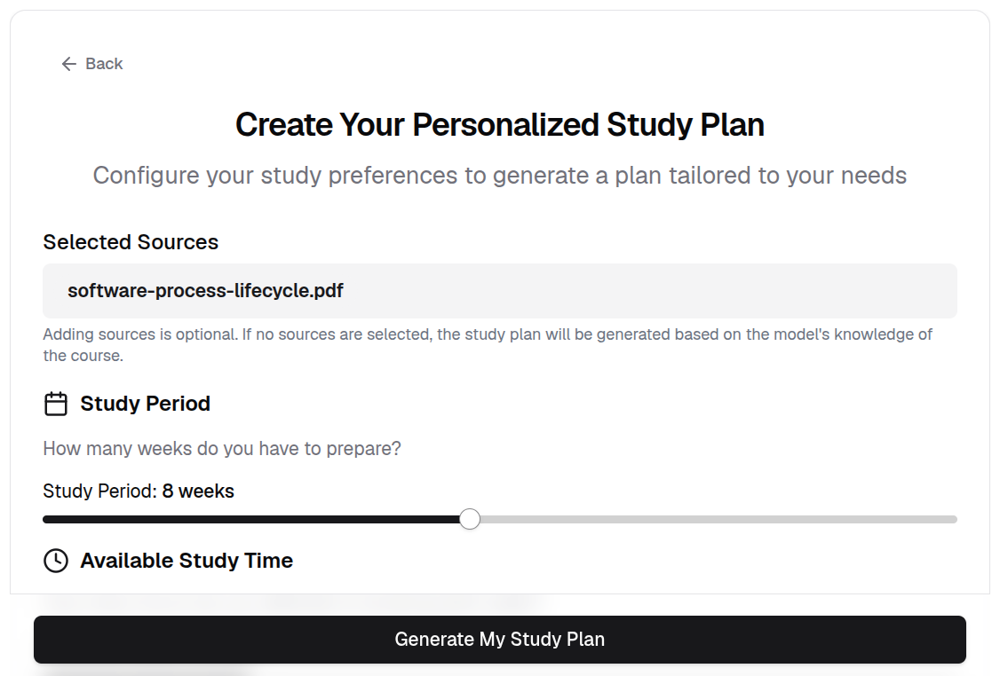
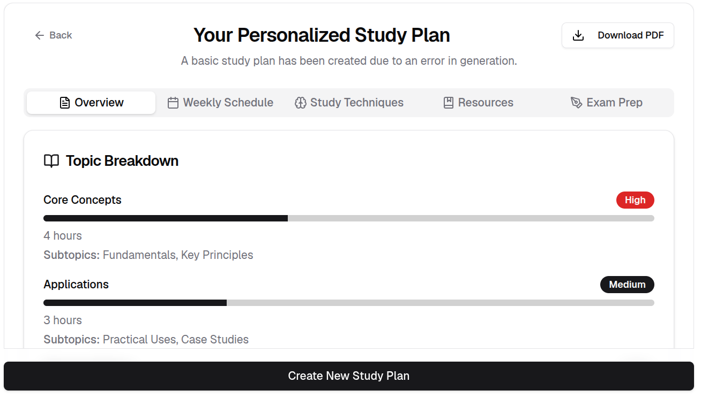

# Learning Companion

The Learning Companion is designed for students who want to independently explore course materials, test their understanding, and plan their studies using AI-powered tools.

This guide covers the full workflow: **Landing Page → Add Courses → Add RAG Document Source → Summary Generator → Quiz Generator → FAQ Generator → AI Chat → Personalized Study Plan Generator**.

## Select Learning Companion Persona

1. On the application home page, click **Learning Companion Persona**.
2. Click **Get Started**.

    

## Landing Page

After selecting **Get Started** as Learning Companion, the landing page is displayed. Click **Add Courses** to upload courses from the installation package.

## Add Courses

1. Click **Courses** then click **Add Courses** to upload courses from the installation package.

    

2. Upload the programme configuration file.

    The programme configuration JSON file is included in the extracted installation package.

    !!! info
        Example programme configuration file name format:

        `programme-<programme_code>-<programme_version>-UCET-<application_version>.json`

    

    After uploading the programme configuration file, click **Next**.

2. Select the courses to add.

    Choose the target courses from the available courses list, then click **Add Selected Courses**.

    

3. Select the active course.

    Select a course from the course selector in the top-left corner.

    

## Add RAG Document Source

Uploaded sources are used for Retrieval-Augmented Generation (RAG) to enhance AI responses across all features.

1. Click **Add Source** in the bottom-left corner.

    

2. Upload your document and click **Upload**.

    !!! info
        The currently supported format is PDF only.

    

3. Check the checkbox next to a source in the sources list.

    !!! info
        Selecting a document as a knowledge source is optional.

    

## Summary Generator

Generate a summary from a single uploaded document.

!!! info
    Only one document can be selected at a time for summary generation.

1. Select a document using the file selector in the sidebar.

    

2. Select the active course from the course selector in the top-left corner.

    

3. Click **Generate Summary** at the bottom of the page.

    

4. Once the summary is generated, scroll to the bottom to find the export options. Select your preferred format to download.

    

## Quiz Generator

The Quiz Generator lets you create quizzes based on your learning materials.

1. In the **Quiz** tab, click **Create Quiz**.

    

2. Configure the quiz type using the available options, then click **Start Now!**.

    

3. Answer the quiz questions and click **Next**.

    

4. Review the quiz summary.

    

## FAQ Generator

1. Check the checkbox next to a source in the sources list to apply a document source.

    

2. Configure the **FAQ Settings**, then click **Generate FAQs**.

    !!! info
        Optionally enter keywords to focus on specific topics.

    

3. Review the generated FAQs. Click **Continue** to generate more FAQs based on the source document.

    

## Personalized Study Plan Generator

1. Upload or select your learning materials using the source selector in the sidebar, then click **Create Study Plan**.

    

2. Configure your study period, available time, and difficulty level, then click **Generate Study Plan**.

    

3. View your study plan with weekly schedules and resources.

    !!! info
        Download your study plan as a PDF for offline reference.

    
---

